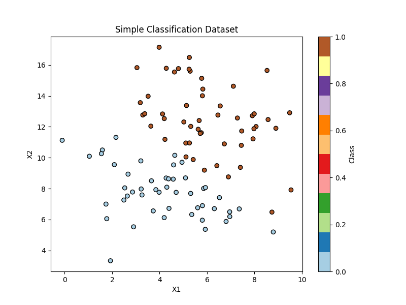

# 朴素贝叶斯分类学习

> 贝叶斯数学分析

$$
P(x)\cdot P(y|x) = P(y) \cdot P(x|y) \tag{0}
$$

由此可推得：

$$
P(y|x) = \frac{P(y) \cdot P(x|y)}{P(x)} \tag{1}
$$

> 朴素贝叶斯分类的一些特征

**贝叶斯分类假设`特征`为`互相独立事件`** 

`独立事件`特征：

$$
P(xy) = P(x)\cdot P(y)\tag{2}
\\ Andthen:P(x_1, x_2, ... , x_n) = P(x_1) \cdot P(x_2)\cdot P(x_3)...\cdot P(x_n)\\
=>P(x_1, x_2, ... , x_n|y) = P(x_1|y) \cdot P(x_2|y)\cdot P(x_3|y)...\cdot P(x_n|y)
$$

*贝叶斯公式多特征用于机器学习*

> 由于分母一致，比较时可以约分，故此可以省略，得：

$$
P(y|X)=P(y|x_1,x_2,...x_n)∝P(y)\cdot P(x_1,x_2,...x_n|y)\tag{2.1}
$$

> 分类原理

*对于给定的样本数据，朴素贝叶斯算法首先计算每个类别的先验概率 `P(Y)`，然后计算在每个类别下每个特征的条件概率 `P(X∣Y)`，最后根据贝叶斯定理计算后验概率 `P(Y∣X)`，并选择具有最高后验概率的类别作为预测结果。*

**假设`C` 为标签，`Z`为样本数据， 我们给`Z`样本贴`标签C`**

* P(Z∣Ci​) 表示在给定类别 Ci​ 的条件下，数据样本 Z 出现的概率，即样本 Z 在类
  
  别 Ci​ 下的条件概率。

q1

$$
P(Z),\ P(C_i), \ P(Z|C_i) \ \Longrightarrow  P(C_i|Z) \tag{3}
$$

*where:*

$$
p(C_i|Z) =max\left \{\ p(C_1|Z), \ p(C_2|Z),\ …\ ,\ p(C_k|Z)\  \right \} \tag{4}
$$

*最终求得最符合标签：* $C_i$

由公式`(1)`可知分母相同，只比较分子即可得：

$$
p(Z|C_i)p(C_i)=max\left \{\ p(Z|C_1)p(C_1) \ ,\ p(Z|C_2)P(C_2)\ , …\right \} \tag{5}
$$

求得最大的 $C_i$概率对应为`Z` 的标签

---

## Question01

* 如果存在某概率为0的情况下，公式`(1)` 怎么办？
  
  * 通过$log$ 将乘转换为加法

* 如果互相独立事件过多，转换为$log$后的浮点数如果超出`32/64/86`操作系统，那么怎么办？
  
  * 我们知道对于 $0 <= P <= 1$ ，用`拉普拉斯法修正`，将`0事件数据`增加`单位1`,其他事件`同样增加单位1`, 
  
  * 猜想，把其$f(x)$ 化, 例如$(0, 1) -> (0,\pi/2) $， 转化为$f(x) = 10^nsin(x)$图向对其求解， $(0, 10^n)$ 为其改变后$f(P)$范围, 范围太小，求出意义？
    
    * 我们对所有范围$log$ 化处理，避免了$P = 0$ 的出现，同时对其$sin(x)$ 处理，如果求出的$P$ 极其小，仍有意义，说明概率极其小。

## Question02

* 如过根据数据集测试出来`Z`的预测标签，但是我们将本次预测加入测试集对其再求结果，然后迭代，求其收敛，是否为最准确预测
  
  * 是否多余操作？
    * 过拟合
    * 数据泄露
    * 无法真实反映模型的泛化能力

---

## Random—test

*随机数据离散分布图*

> 

### 奇思妙想?

> log化$P（y）\cdot p(x1, x2,|y)$ 然后对其映射$z（0，pi/2）$,对其取$10^nsin(z)$即为
> 
> $P(y1|x1,x2) = \sum 10^nsin(z) $
> 
> 引入单位概念，单位值越高，其概率越大，只是一种思想，上述也可换成$cos^-(x)$
> 
> 对测试集预测

如果对其进行贝叶斯反演，则p越小则说明其越符合z
