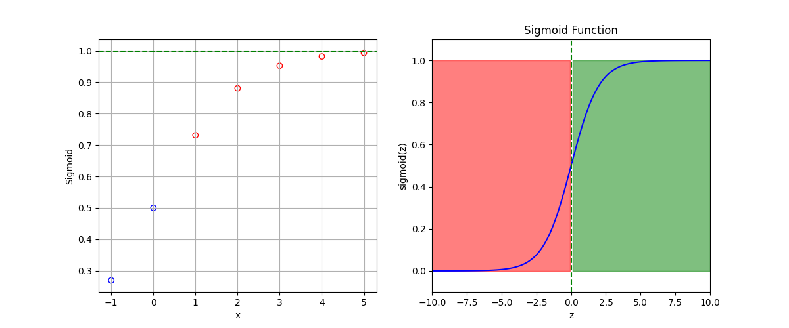
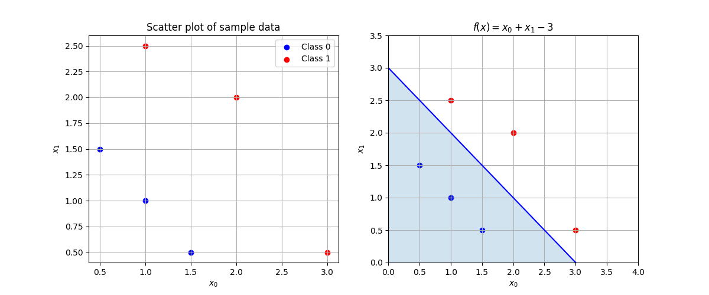
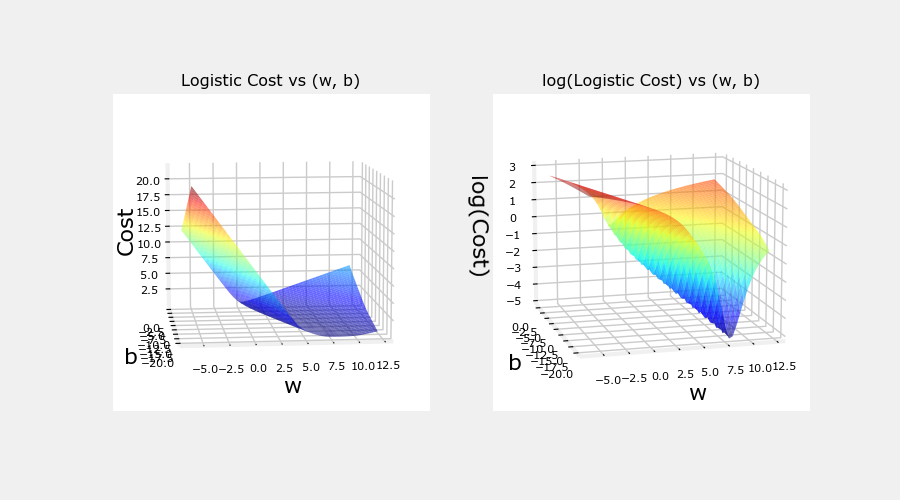

# 分类🐈🐈‍⬛

> 你是否记得曾经火爆全网cat的识别? 第一步就是如何分类，如果量纲化数据为 **`R`**，那么分类问题总要有个边界，可是如果边界问题的值域无法界定，我们就要采用类似标准化高斯函数的思想。

- Sigmoid 归一化

$$
f(z) = \frac{1}{1 + e^{-z}}
$$

> 

- Boundary 界限
  
  > 例如（不仅只有线性函数）:
  > 
  > $$
  > f(X) = w_0x_0 + w_1x_1 + b\tag{1}
  > $$

**x1**为`x轴`，**x2**为`y轴`，边界函数：

$$
x_1 = \frac{-w_0x_0-b}{w_1}\tag{2}
$$

> 以f(X) = x0 + x0 - 3 为例子   
> 

---

> 如果将`J(w, b)`函数与Sigmoid关联，则图像非**凹**状，映射到**2D图像**上则存在**多个极限值**

数学分析：

$$
J(w, b) =  \frac{1}{2m}\times  \sum_{i = 0}^{m - 1}\left ( f(x_{i}) - y_{i} \right ) ^{2}
$$

_Where:_

$$
f(x_i) = f(z) =  Sigmoid(w_ix_i + b_i)
$$

为了能使极限值唯一，也就是图像存在最好的边界分割，引入`Loss`函数

> 

$$
\text{loss}(f_{\mathbf{w},b}(\mathbf{x}^{(i)}), y^{(i)}) = \begin{cases}    - \log\left(f_{\mathbf{w},b}\left( \mathbf{x}^{(i)} \right) \right) & \text{if } y^{(i)} = 1 \\    - \log \left( 1 - f_{\mathbf{w},b}\left( \mathbf{x}^{(i)} \right) \right) & \text{if } y^{(i)} = 0\end{cases}
$$

*as well as:*

> 

$$
loss(f_{\mathbf{w},b}(\mathbf{x}^{(i)}), y^{(i)}) = (-y^{(i)} \log\left(f_{\mathbf{w},b}\left( \mathbf{x}^{(i)} \right) \right) - \left( 1 - y^{(i)}\right) \log \left( 1 - f_{\mathbf{w},b}\left( \mathbf{x}^{(i)} \right) \right)
$$

修改后图像：

> 
